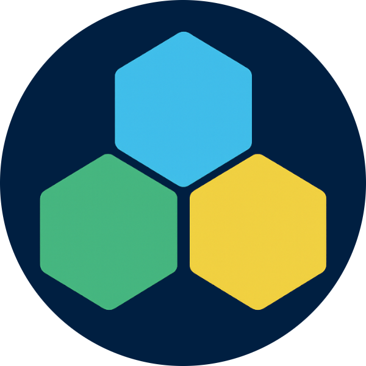

  

# Jonatas Sas

## Backend & Full Stack Developer

Backend and Full Stack Developer with 21+ years of experience designing and maintaining enterprise-grade systems across banking, fintech, e-commerce, SaaS, and real estate sectors.

I specialize in backend architecture, secure API design, and system performance optimization — delivering robust solutions for mission-critical environments with high availability and low downtime requirements. I’ve also developed backends for high-traffic mobile applications and distributed platforms.

Currently working remotely with international teams to build scalable, maintainable, and production-ready systems that support real business operations.

**Core Expertise:**

* **Languages & Frameworks:** PHP (Laravel, Yii2, Magento, WordPress, etc.), Go, Python, Node.js (JavaScript)
* **Frontend:** HTML, CSS, JavaScript (React, Vue, Angular)
* **Databases:** PostgreSQL, MySQL, MariaDB, etc.
* **Domains:** Backend Architecture, Microservices Design, API Development, CI/CD, Test Automation, Secure Coding, Infrastructure Automation, Legacy Modernization, System Hardening, Performance Optimization, SEO Implementation & Audits, Security Reviews

Although I specialize in backend systems, I’m also comfortable working across the full stack when needed — including modern frontend frameworks, CMS platforms like WordPress, and integration-heavy environments.

Committed to code quality, reliability, and long-term maintainability — applying robust testing strategies, automated pipelines, and architectural rigor to ensure consistent delivery.

---

## Selected Open Source Projects

* [`yii2-m2m-behavior`](https://github.com/jsas4coding/yii2-m2m-behavior) — Simplifies many-to-many relations in Yii2 Active Record
* [`pma-up`](https://github.com/jsas4coding/pma-up) — Automated phpMyAdmin updater (Go)
* [`tools-electron-app-generator`](https://github.com/jsas4coding/tools-electron-app-generator) — CLI scaffolder for Electron apps (Python)

---

## Open to Work On

* Backend Architecture for Distributed & High-Availability Systems
* Microservices Design & Implementation
* API Design & Third-Party Integrations
* Refactoring & Modernizing Legacy Codebases
* CI/CD Pipelines & Infra Automation
* Automated Testing & Quality Assurance
* SEO Optimization & Technical Audits
* Performance Optimization & Secure Coding
* WordPress-based Architecture & Customization
* Security Reviews & Hardened Deployments

**Available for remote freelance opportunities** — from architecture planning to end-to-end backend development. Feel free to reach out via [Telegram](https://t.me/jsasdev) or [WhatsApp](https://wa.me/5511930601950) to start a conversation.

---

## Contact

* [GitHub](https://github.com/jsas4coding)
* [LinkedIn](https://www.linkedin.com/in/jsas4coding)
* [X (Twitter)](https://x.com/SasJonatas)
* [Mastodon](https://mastodon.social/deck/@jsas)
* [Dev.to](https://dev.to/jonatas_sas)
* [Medium](https://medium.com/@jonatassas)
* [Telegram](https://t.me/jsasdev)
* [WhatsApp](https://wa.me/5511930601950)

---

> *Engineering stable, scalable, and secure systems that keep real-world businesses running.*
